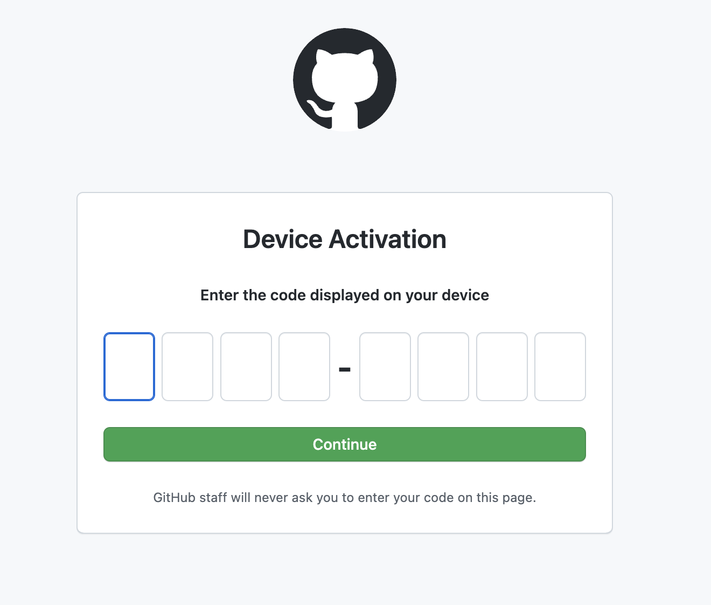
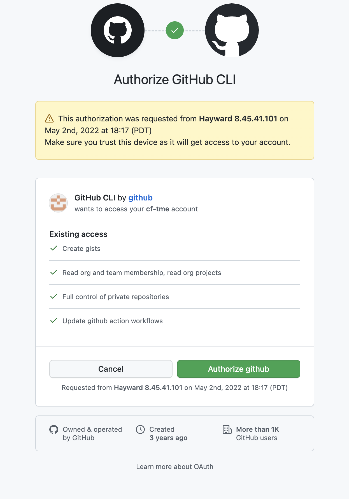
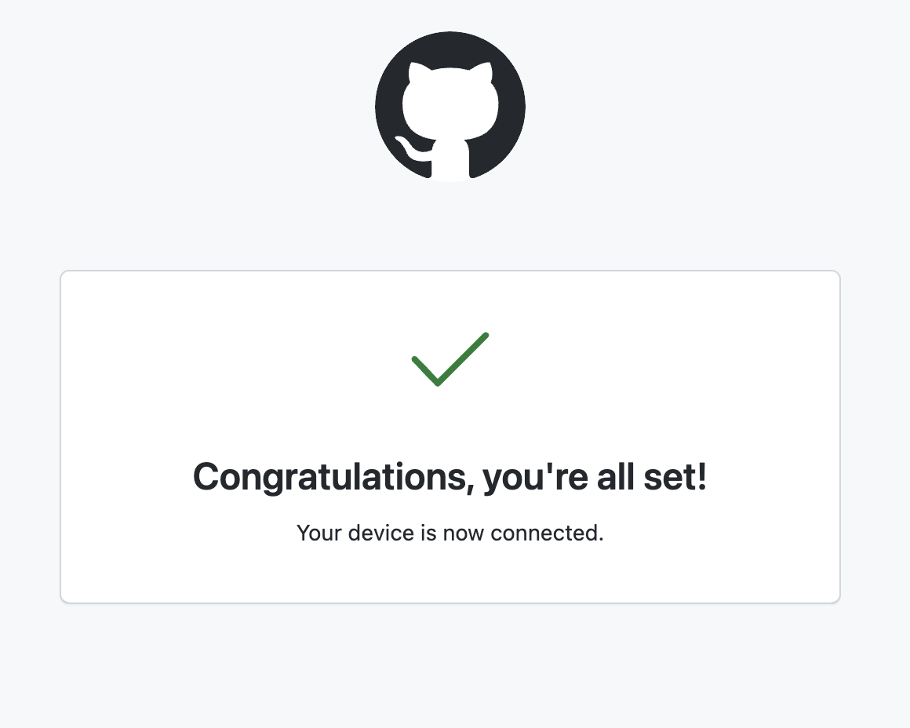

# Setup Github
## Install Github CLI
GitHub will be used as our code hosting platform - the GitHub CLI will be used to login to our GitHub Account as well as manage repositories 
### MacOS
**Install Homebrew:**

The fastest way to install packages onto MacOS is with Homebrew, if you already have Homebrew installed you can skip this step

To install Brew, in a terminal window enter

``` sh
/bin/bash -c "$(curl -fsSL https://raw.githubusercontent.com/Homebrew/install/HEAD/install.sh)"
```

**Install GitHub CLI:**

In a terminal window enter:

``` sh
brew install gh
```
### Linux

Installation of the GitHub CLI can be done with the built in package managers on most all linux distributions - to cover common use cases the steps below are for Debian and CentOS

**Debian, Ubuntu Linux, Raspberry Pi OS (apt)**
``` sh
curl -fsSL https://cli.github.com/packages/githubcli-archive-keyring.gpg | sudo dd of=/usr/share/keyrings/githubcli-archive-keyring.gpg
echo "deb [arch=$(dpkg --print-architecture) signed-by=/usr/share/keyrings/githubcli-archive-keyring.gpg] https://cli.github.com/packages stable main" | sudo tee /etc/apt/sources.list.d/github-cli.list > /dev/null
sudo apt update
sudo apt install gh
```
**Fedora, CentOS, Red Hat Enterprise Linux (dnf)**

``` sh
sudo dnf install 'dnf-command(config-manager)'
sudo dnf config-manager --add-repo https://cli.github.com/packages/rpm/gh-cli.repo
sudo dnf install gh
```

### Windows

Installation of GitHub CLI can be done with powershell winget package manager. Open PowerShell and enter the following installation command:

``` sh
winget install --id GitHub.cli
```

If prompted enter *Y* to approve installation

Once installation is complete you must add GitHub CLI installation to the Windows PATH:

```sh
$Env:PATH += ";C:\Program Files\GitHub CLI"
```


## Login to Github CLI
Once Github CLI is installed you can authenticate to your Github account.
In a terminal window enter:

``` sh
gh auth login
```
At the follow up prompt select *Github.com* and press enter

``` sh
? What account do you want to log into?  [Use arrows to move, type to filter]
> GitHub.com
  GitHub Enterprise Server
```

At the next prompt select *HTTPS* and press enter

``` sh
? What is your preferred protocol for Git operations?  [Use arrows to move, type to filter]
> HTTPS
  SSH
```

Enter *Y* to authenticate with GitHub credentials

``` sh
? Authenticate Git with your GitHub credentials? (Y/n)
```

Select *Login* with a web browser

``` sh
? How would you like to authenticate GitHub CLI?  [Use arrows to move, type to filter]
> Login with a web browser
  Paste an authentication token
```

Copy the provided one-time code and press *Enter* to open browser

``` sh
! First copy your one-time code: XXXX-XXXX
Press Enter to open github.com in your browser...
```

When the browser opens - enter the one time code into the browser and press *Continue*



*Authorize* access on the following page



If prompted enter your password in the following screen and press *Confirm Password*


If the login is successful you should see a success page



```{admonition} GitHub Setup Complete! 
:class: note
You have successfully setup GitHub CLI! Next step is setting up Setting up Git CLI
```