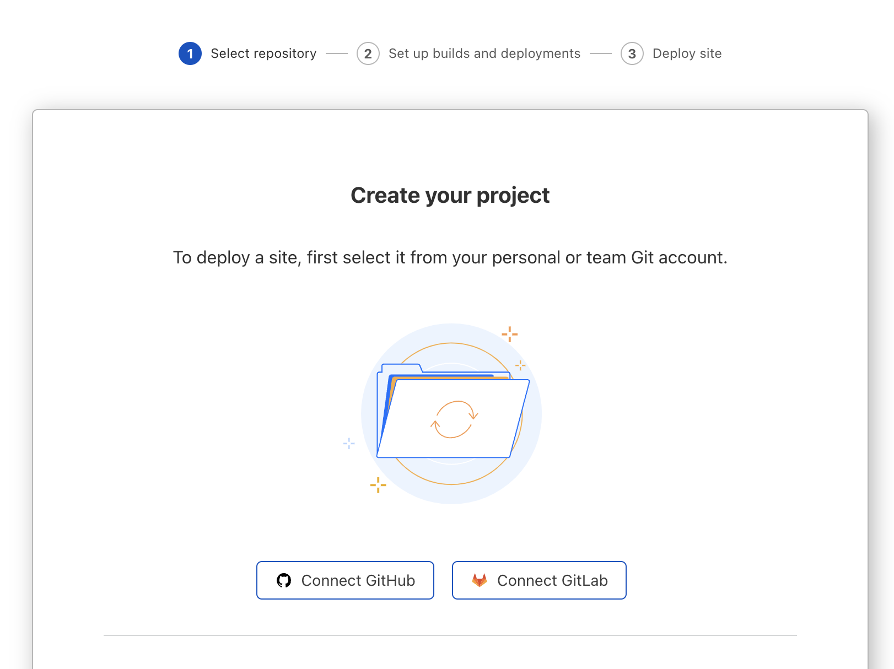
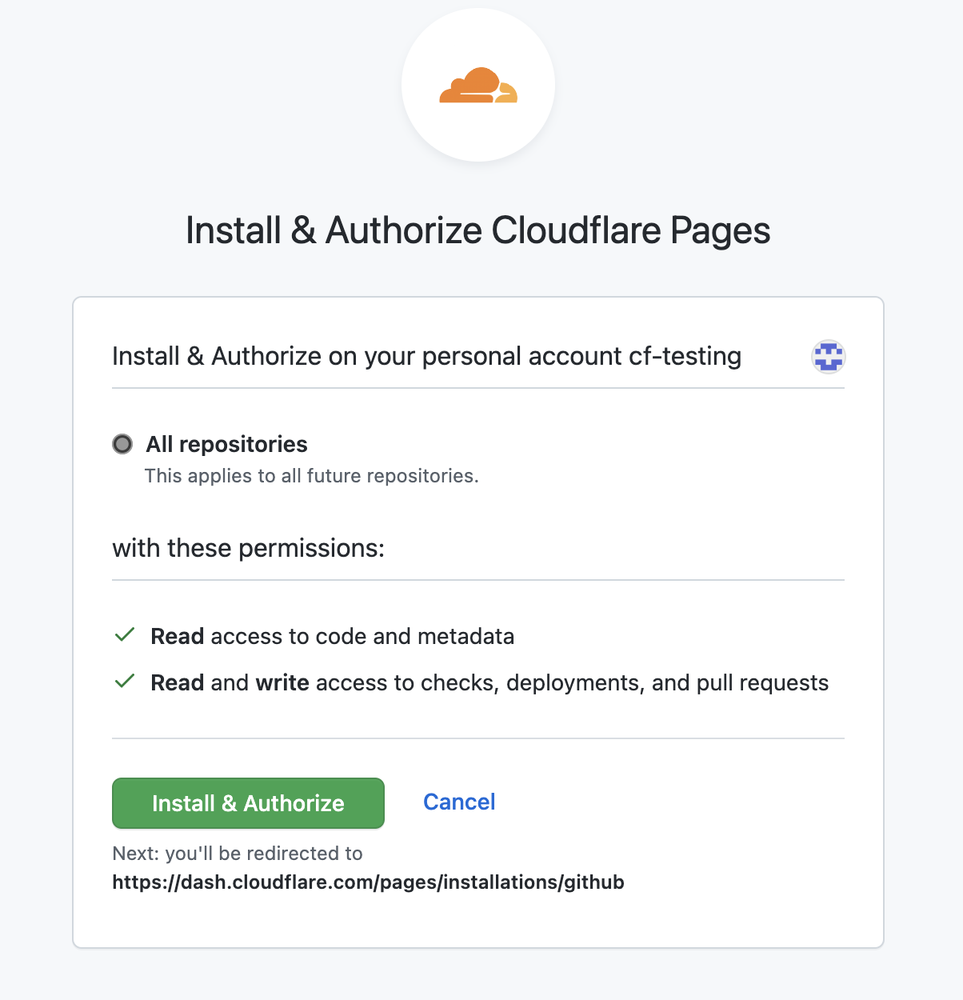
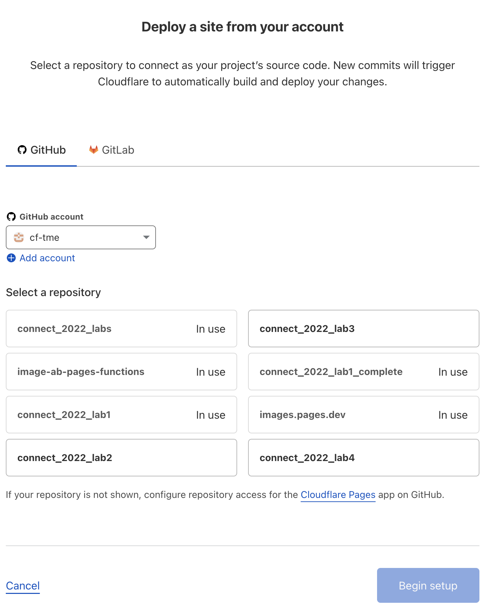
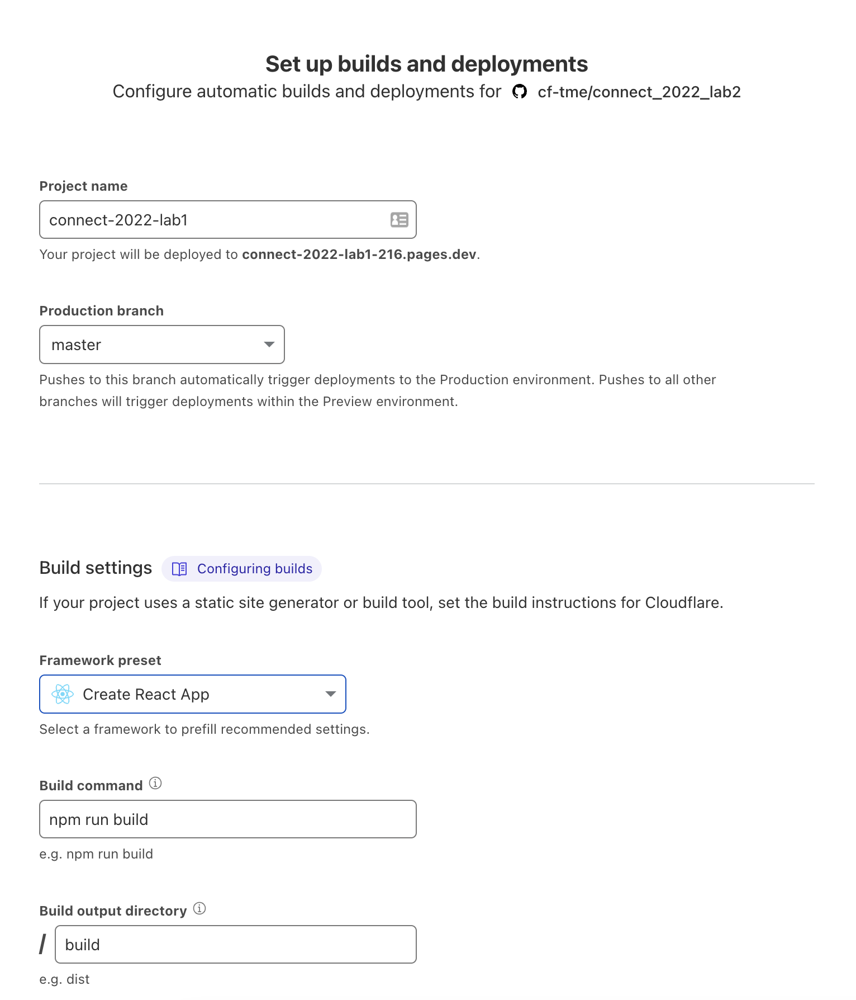
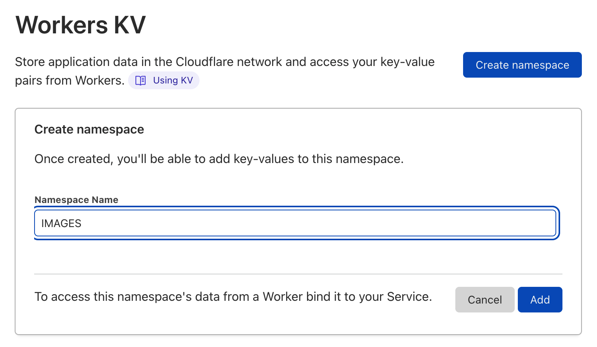
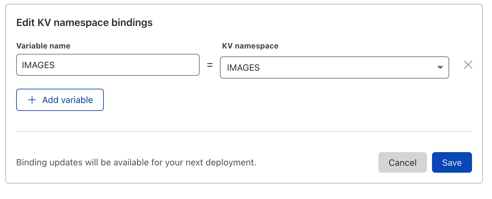
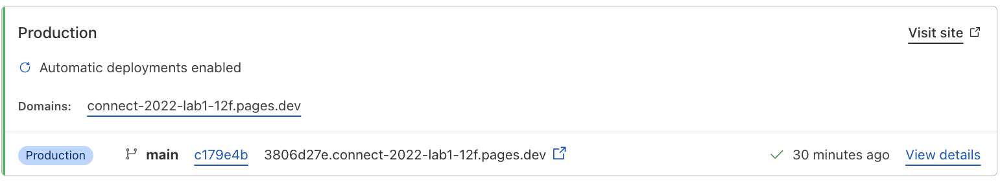
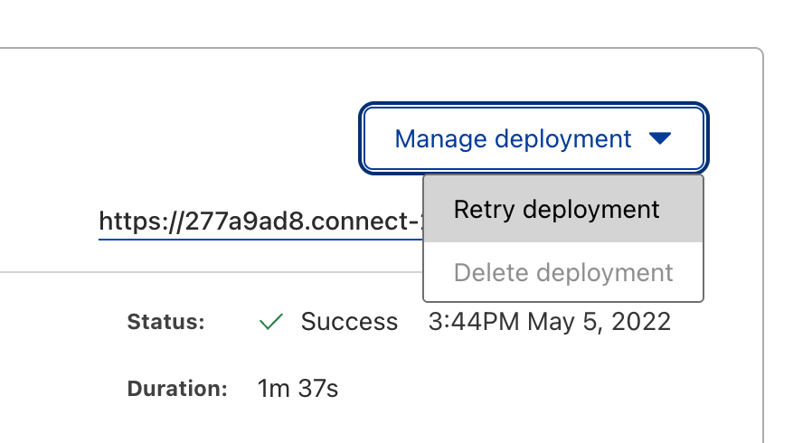
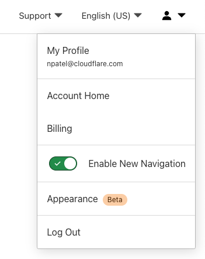
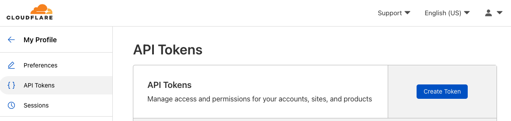

# Cloudflare Images
Welcome to Lab 2 at Cloudflare Connect 2022 - This lab will focus on Uploading and Delivering Images via Cloudflare Images
By the end of this lab you will have:

- Uploaded images to Cloudflare via the API
- Used Image variants
- Seamlessly integrated Cloudflare Images and Pages


Cloudflare Images provides a straightforward, end-to-end solution to cost-effectively build and maintain your image infrastructure. Store, resize, and optimize images at scale using one unified product.

```{admonition} Learn More about Cloudflare Images! 
:class: note
Check out the [Cloudflare Homepage](https://www.cloudflare.com/products/cloudflare-images/) to learn more
```
## Clone Project & Connect KV Store (New Students) ##

```{admonition} Already Complete Lab 1?
:class: note
If you have already completed Lab 1 Skip ahead to this [section](content:references:skip)
```

### Clone GitHub Repository ###
To make things easier we have setup a starter gallery app on GitHub. Lets fork and clone the repository.

``` sh
gh repo fork cf-tme/connect_2022_lab1_complete
```
This should create a fork of the complete Lab 1 repository in your gh account. Follow the fork with a clone

``` sh
gh repo clone <yourgithubusername>/connect_2022_lab1_complete
```

Now all the files should be local in your working directory, let navigate into the repo to start coding! 

``` sh
cd <yourgithubusername>/connect_2022_lab1_complete
```

### Deploy project to Pages ###
Deploying our GitHub project to pages is as simple as connecting our GitHub account to Cloudflare.

Login to the [Cloudflare Dashboard](https://dash.cloudflare.com)

Select **Pages** on the left hand side and press **Create a Project** and select **Connect GitHub**



```{admonition} Authenticate to GitHub
:class: note
If you are not already logged into GitHub in your browser you may be asked to re-authenticate
```
You will be prompted to **Install and Authorize** Cloudflare Pages to your github account, press the button to proceed.



Once connected you will be brought back to the Cloudflare Pages dashboard. Select *connect_2022_lab1* on the following page 



Once selected you will need to configure build parameters. This is build using React so we will set the following build parameters:

```
Project name - connect_2022_lab1_complete
Production branch - master
Framework preset - Create React App
Build command - npm run build
Build output directory - /build
```




Press **Deploy**

```{admonition} Deployment Progress
:class: note
Once started the deployment will take a few moments to complete - you can follow the deployment details to monitor progress of the deployment.
```
Once the deployment has completed you will be presented with a success message as well as a URL to visit your new project Select the **link**.
```{admonition} pages.dev Domain
:class: note
By default new projects will automatically be given a *.pages.dev domain, If you would like to setup custom routes to your own domain you can do that through DNS CNAMEing (or directly in the project settings if your domain nameservers are Cloudflare)
```

Before we test out application we need to create and Bind a KV namespace

### Creating an IMAGES KV Namespace
Our application has been written to read data from env.IMAGES - this means we need to bind our KV namespace to our project with the variable name "IMAGES"

From your Cloudflare account landing page navigate to **Workers > KV** 

```{admonition} Verify Email
:class: Note
If you have not already confirmed your e-mail address for your Cloudflare Account you may be asked to Verify it here before creating any KV namespaces
```

Select **Create Namespace** and enter *IMAGES* in the *Namespace Name* and press **Add**



```{admonition} Namespace ID
:class: Note
Once  your namespace is created you will be given a Namespace ID - this will be needed later on in Lab 2, so if you plan on joining us for Lab 2 go ahead and take note of this id - you can always navigate back to this screen and grab it later if needed.
```

### Binding KV Namespace to Pages Project ###

Once our Namespace is created we must bind it to our Pages project so that our functions can leverage the data inside.

```{admonition} Look Ahead
:class: Note
We will be using this namespace to store Image metadata that will then be read in dynamically update our gallery with images that we upload!
```
From the Left hand side navigation pane on the Cloudflare Dashboard select **Pages** then select our project *connect_2022_lab1_complete* 

In the top navigation bar select **Settings** and then **Functions** On the left hand side.


Select **Add binding** under the *KV namespace binding* (under *Production* sub-tab)

Enter *IMAGES* in the Variable name and Select the *IMAGES* KV namespace from the dropdown. And press **Save**



```{admonition} Manual Re-Deploy
:class: Note
In order for KV binding to take effect we need to rebuild the project - this is generally not an issue when live developing as a git push will force it but in this case to test a few things out we will manual kick off a re-deployment
```
#### Manually Re-Deploy Application ####

To kick off a manual re-deployment we must first select *View build* (in the bottom right) on the latest deployment of our application.



On the following page select **Manage Deployment** in the top right and press **Retry Deployment**



This will kickoff a manual deployment, give it a few moments to complete.


Congratulations you are now all caught up! If you navigate to the url that was generated for you Pages project you should see a blank gallery (plain blue page).

(content:references:skip)=
## Generate API Keys for account ##

Before we can upload images or write values to our KV store with the API We need to generate API keys for our account. 

```{admonition} Images API Key
:class: Note
Cloudflare Images is a Paid product, for this lab you will be using a shared Images account with provided API keys, in the real world you would swap out the Keys for your own.
```

To generate API keys navigate to the [Cloudflare Dashboard](https://dash.cloudflare.com), login and select your user on the top right and select **My Profile**



On the left navigation pane select **API Tokens** and press **Create Token**




Some **text**!

for those of you returning from previous lab go ahead and SKIP to this section


clone the lab 1 complete repository 

create a KV namespace called Images 
note the ID 

got to pages and deploy the application 

bind the namespace in settings 

then re-build the projkect

the url for api/images should return empty

and the homepage should be blank


SKIP 
clone the lab 2 github repository 


ensure that python is installed (write the steps for prereq)


open up the image upload file in your favorite editor

now we need some value 
find this from when we created the KV namespace - if you forgot go to workes → kv namespaces and select IMAGES there shoudld be an ID there

kv_id = "ENTER YOU WORKERS KV NAMESPACE ID"

this can be easily found in the URL after "dash.cloudflare.com" that value is your account ID 

kv_account_id = "ENTER YOUR CLOUDFLARE ACCOUNT ID"

we need to generate a new API token - lets do that 


kv_token ="ENTER YOUR API TOKEN"


now that we have all of our values filled in lets take a look at the code -

the first part is uploading images to cloudfalre pages 
>> since we are using a common images account 

we only only have one image variant in this account but its important to note that you can define any number of variants just by creating a variant and changing the URL 

once we do the upload we are then writing the image metadata to KV - this will be in the right format for our homepage to show the new images we upload 


- lets go ahead and ruyn it! 


terrfici we should ahve gotten an aoutput that looks something like: 
uploaded image gallery-images/cat1.jpeg and added KV metadata with status True

uploaded image gallery-images/cat2.jpeg and added KV metadata with status True

uploaded image gallery-images/cat3.jpeg and added KV metadata with status True

uploaded image gallery-images/pup1.jpeg and added KV metadata with status True

uploaded image gallery-images/pup2.jpeg and added KV metadata with status True

uploaded image gallery-images/pup3.jpeg and added KV metadata with status True


this means that our images were uploaded and the metadata was written it should look something like below! 


Now if go back to our homepage and navigate to /api/images 

this should return a full list of images 
and our homepage should now have a full array! 

AWESOME! congratulations you create a FULL stack application with Workers, KV, and IMAGES! 
