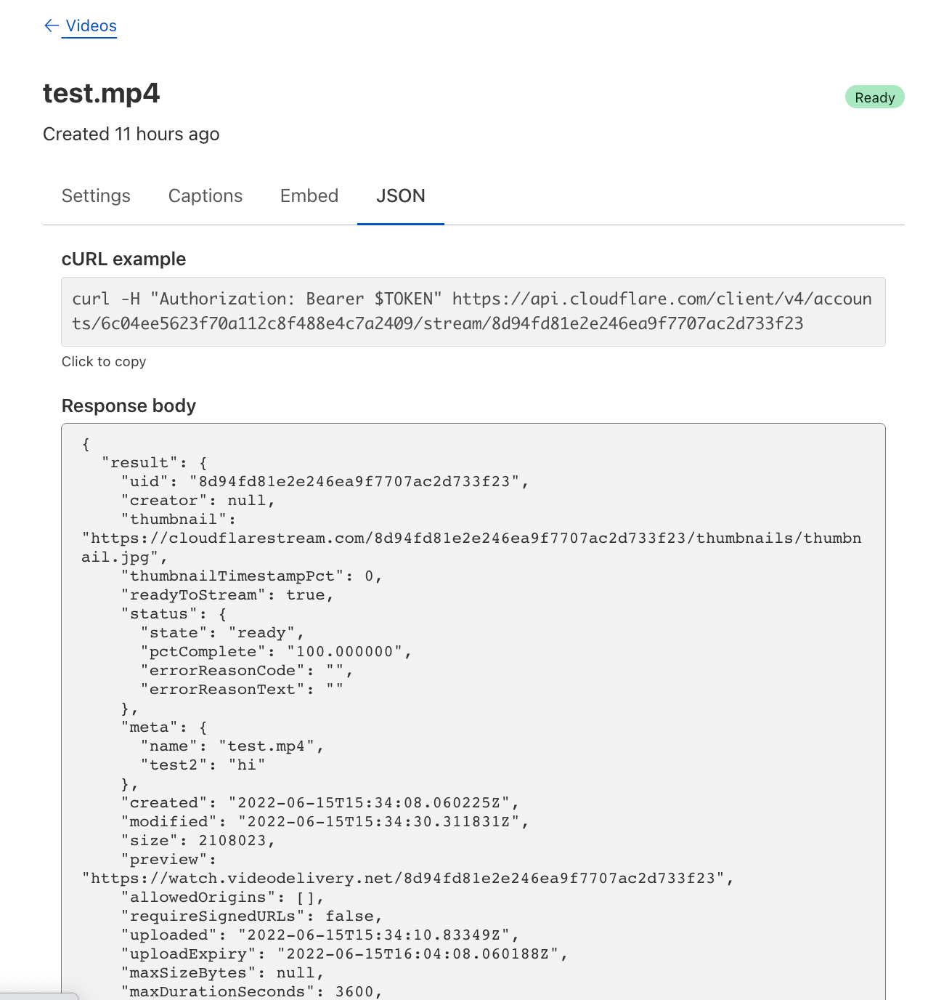
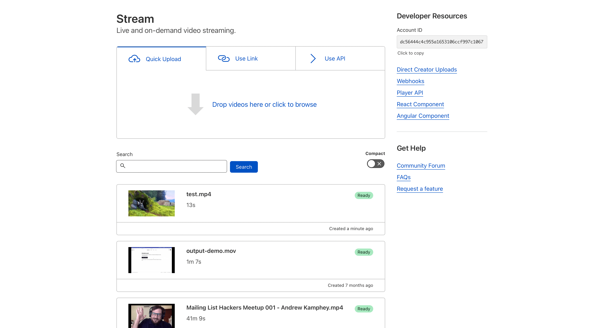
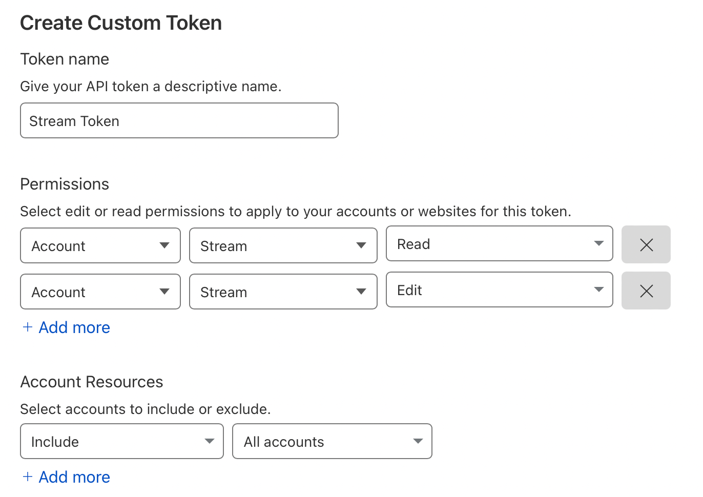

# Lab 4 - Cloudflare Stream

Welcome to Lab 4 at Cloudflare Connect 2022 - This lab will focus on getting up and running with Cloudflare Stream.

By the end of this lab you will have:

- Explored the Cloudflare Stream dashboard
- Upload a video to Cloudflare Stream using Stream Direct Uploads, eliminating the need for storage buckets
- Example code to continue using and integrating Stream into your projects

Stream is an enterprise-scale API that lets Cloudflare customers build serverless apps with minimal engineering effort and cost. 

```{admonition} Learn More about Cloudflare Stream!
:class: note
Check out the [Cloudflare Homepage](https://www.cloudflare.com/products/cloudflare-stream/) to learn more
```

## Exploring the Stream dashboard

The Stream dashboard allows you to manage, view and upload videos without needing to write code. The Dashboard also provides example  cURL commands for common operations, helping you fast-track app development.



In our workshop, we'll be working with some example code to show how you can quickly build a video sharing app with Workers and Stream. The mini app will enable users to upload videos using Cloudflare Workers and the Stream API. But the dashboard remains a great way to understand what's being uploaded to your Stream account.



Visit [dash.cloudflare.com/profile/api-tokens](https://dash.cloudflare.com/profile/api-tokens) and select "Create Token". Use the below screenshot as an example of how to configure the token -- specifically, the "Stream - Read" and "Stream - Edit" settings.



More on dash

## Understanding Stream Direct Uploads

Stream's [Direct Creator Upload API](https://developers.cloudflare.com/stream/uploading-videos/direct-creator-uploads/) enables you to directly accept user uploads without exposing your API Key. By using the Direct Creator Uploads API, you eliminate the need to use storage buckets and leverage built-in storage. 

To use the Direct Upload feature, we'll make a client-side HTTP request to obtain a new tokenized upload URL:

```js
let response = await fetch('/token');
let uploadToken = await response.text();
uprog.videoId = uploadToken;
```

In a Pages Function, defined at `functions/token.js`, we can create a new request to the Stream API, including our credentials - an auth email and API key - which will create a unique Direct Upload URL.


```js
// functions/token.js

export async function onRequestGet({ env }) {
  const init = {
    method: 'POST',
    headers: {
      'X-Auth-Email': env.STREAM_AUTH_EMAIL,
      'X-Auth-Key': env.STREAM_AUTH_KEY,
    },
    body: "{\"maxDurationSeconds\":3600,\"meta\":{\"name\":\"My First Stream Video\",\"test2\":\"hi\"}}"
  }
  const response = await fetch(`https://api.cloudflare.com/client/v4/accounts/${env.STREAM_ACCOUNT_ID}/stream/direct_upload`, init)
  const results = await response.json();
  return new Response(results.result.uploadURL, { 
    headers: { 
      'Access-Control-Allow-Headers': '*', 
      'Access-Control-Allow-Origin': '*' 
    } 
  })
}
```

With the Direct Upload URL created, we can update the submission form for the video, and begin making a request to upload the video file to the Direct Upload URL.

```js
let file = uprog.hFile.files[0];
let xhr = new XMLHttpRequest();
let data = new FormData();
data.append("file", file);
xhr.open("POST", uploadToken);
```

```{admonition} Uploads larger than 200mb
:class: note
The _Basic_ upload format seen in this workshop will support video files up to 200mb. For larger files, use the `tus` protocol, as [described in our documentation](https://developers.cloudflare.com/stream/uploading-videos/direct-creator-uploads#using-tus-recommended-for-videos-over-200mb).
```

## How to use the example code

This example code is designed to give you a starting point to build applications based on Stream. You can re-use these serverless functions or the frontend to allow submission of user-generated content.

For the complete open-source code, check out the [repo on GitHub](https://github.com/codewithkristian/connect-stream-demo/).

```{admonition} LAB 4 COMPLETE! 
:class: note
You have successfully Completed Lab 4 - Cloudflare Stream. Next, [check out the documentation](https://developers.cloudflare.com/stream/) to learn more about what you can build with Stream.
```
