# Cloudflare Zero Trust Gateway
Welcome to Lab 4 at Cloudflare Connect 2022 - This lab will focus on setting up a simple DNS forwarder to leverage Cloudflare Zero Trust Gateway's DNS filtering on any network.
By the end of this lab you will have:

- Setup Cloudflare Tunnel as a DoH (DNS over HTTPS) Forwarder
- Configured DNS based filtering in Cloudflare ZT Gateway
- Built a ready to deploy Docker Compose file to deploy setup anywhere

Cloudflare Zero Trust Gateway is designed to keep your data safe from malware, ransomware, phishing, command & control, Shadow IT, and other Internet risks over all ports and protocols. Today we will only be setting up DNS based filtering but it can be used as a full Secure Web Gateway.

```{admonition} Learn More about Cloudflare Zero Trust Gateway! 
:class: note
Check out the [Cloudflare Homepage](https://www.cloudflare.com/products/zero-trust/gateway/) to learn more
```

## Setup Docker Environment

For flexible deployment we will be building this entire setup using Docker. Containers are an easy way build and deploy services on varying platforms - this means you can take the setup you build today on your local system and migrate it to a local home or lab environment with almost no configuration changes.

### MacOS
To install Docker on MacOS we will again use brew if you have not already setup brew on your MacBook jump up to the [MacOS setup section](github.md) and install it.

Once Brew is installed, in a terminal window enter:

``` sh
brew install --cask docker
```

Once docker is installed launch it from either MacOS Launchpad or Spotlight.

Once installed validate that Docker is installed and running:

At launch docker will prompt you for privileged access to MacOS

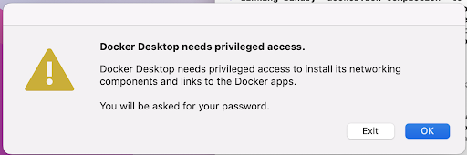

Once complete you should see this window - indicating successful deployment

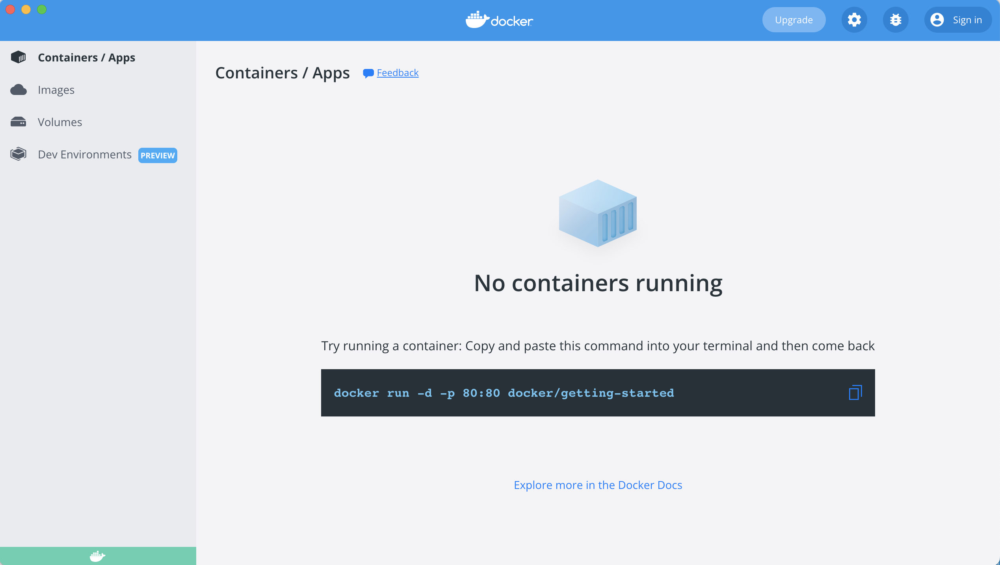

Now you should be able to run the version command below to see the version installed and confirm the service is running properly.

``` sh
docker --version
```
```{admonition} No Version? or Error
:class: warning
If you do not see a Docker version or the command errors you may need to start the Docker application first, this can be done by launching it from Application or Spotlight on your MacOS device.
```

### Linux

Installation of the Docker can be done with the built in package managers on most all linux distributions - to cover common use cases the steps below are for Debian and CentOS

**Debian, Ubuntu Linux, Raspberry Pi OS (apt)**

Update apt packages 

``` sh
sudo apt-get update
sudo apt-get install \
    ca-certificates \
    curl \
    gnupg \
    lsb-release
```

Add the Docker GPG Key

``` sh
curl -fsSL https://download.docker.com/linux/debian/gpg | sudo gpg --dearmor -o /usr/share/keyrings/docker-archive-keyring.gpg
```

Add the *stable* repo

``` sh
echo \
"deb [arch=$(dpkg --print-architecture) signed-by=/usr/share/keyrings/docker-archive-keyring.gpg] https://download.docker.com/linux/debian \
$(lsb_release -cs) stable" | sudo tee /etc/apt/sources.list.d/docker.list > /dev/null
```

Install Docker Engine

``` sh
sudo apt-get update
sudo apt-get install docker-ce docker-ce-cli containerd.io docker-compose-plugin
```

Once installed validate that Docker is installed and running:

``` sh
docker --version
```

**Fedora, CentOS, Red Hat Enterprise Linux (dnf)**

Add the *stable* repo

``` sh
sudo dnf -y install dnf-plugins-core
sudo dnf config-manager \
    --add-repo \
    https://download.docker.com/linux/fedora/docker-ce.repo
```

Install Docker Engine

``` sh
sudo dnf install docker-ce docker-ce-cli containerd.io docker-compose-plugin
```

Once installed validate that Docker is installed and running:

``` sh
docker --version
```
### Windows
Installation of Docker can be done with powershell winget package manager. Open PowerShell and enter the following installation command:

``` sh
winget install docker.dockerdesktop
```

If prompted enter *Y* to approve installation

Follow the onscreen prompts to complete installation

```{admonition} Install Prompts
:class: note
If you get prompted to choose the type of installation the easiest method is to select "WSL2" - this will use *Windows Subsystem for Linux* to setup Docker environment
```

Once installed Launch docker application from desktop icon and validate that Docker is installed and running via powershell:

``` sh
docker --version
```

```{admonition} Docker Setup Complete! 
:class: note
You have successfully setup Docker! Lets Get Started Deploying Cloudflare ZT Gateway!
```

## Deploy DNS Server & Cloudflare Tunnel for DoH ##

With Docker running we can now pull down the template Docker Compose file that will allow us to quickly deploy a local DNS server (pi-hole) and Cloudflare DoH forwarder (Cloudflare tunnel) together.

Clone the repo that contains the Docker compose file

``` sh
gh repo clone cf-tme/connect_2022_lab4
```

Move into the Directory that was just cloned 

``` sh
cd connect_2022_lab4
```

Once in the directory you should see a *docker-compose.yml* file open this file in your favorite text editor 

```{admonition} Text Editor
:class: note
VS Code is a versatile text editor that can be launched directly from the terminal using *code <filename>* to install VS Code follow the steps found in the [Documentation](https://code.visualstudio.com/download)
```
### Understanding Docker Compose file ###
With the file open lets take a moment to break it down and understand it, The file is split up into two logical sections, one for each service we will be starting up
- Pi-Hole Service
- cloudflared Service

We will be using Pi-Hole as the local dns resolver, for those unfamiliar with Pi-Hole, it is a powerful dns server designed to sinkhole common ad serving domains to create a cleaner browsing experience for all connected devices. 

```{admonition} Learn More!
:class: note
To learn more about Pi-Hole check out the [website](https://pi-hole.net/)
```

Pi hole is designed to be run on the Raspberry-Pi hardware platform but since we are building it in a container it can easily be ported to whatever platform you like.

In order for Pi-hole to resolve internet domains it will need to be configured with an upstream DNS server to resolve internet domain names - this is where the cloudflard service comes into play.

The cloudfalred service will act as an upstream resolver for Pi-Hole and use Cloudflare ZT Gateway (via DNS over HTTPS) to resolve internet domains - this means that not only are our internet DNS queries encrypted and secure, we can also customize policies on what kinds of traffic is allowed.

The below diagram will help visualize the traffic flow

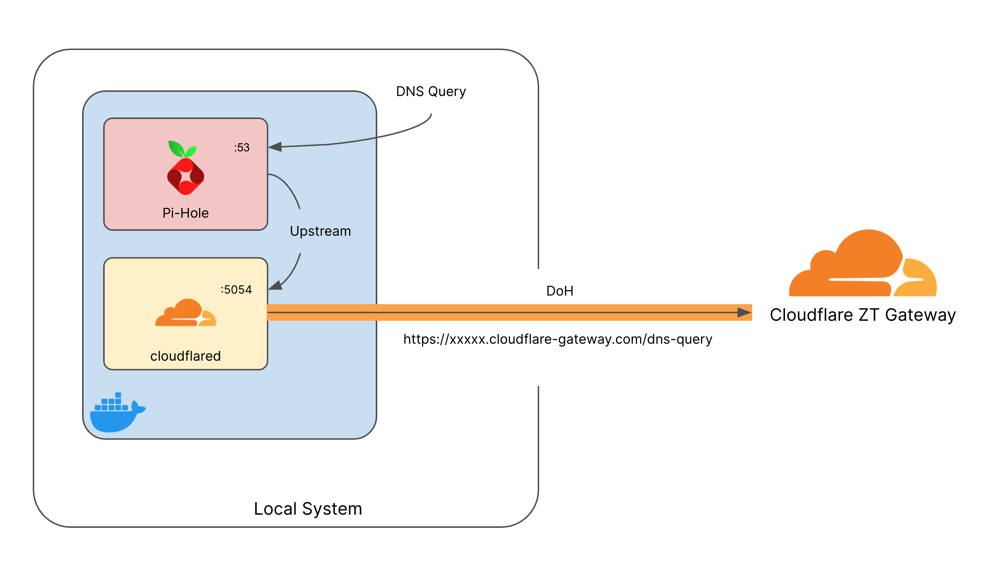

Based on this you can see that once everything is done, the docker host will be the primary DNS server for the network.

### Modify Docker Compose file ###

Take a closer look at the configuration in the Docker Compose file and read the comments to understand whats happening.

Now that you have reviewed the file you may have noticed there is a specific environment variable for the cloudflared service the *TUNNEL_DNS_UPSTREAM* this value will need to be taken from your Cloudflare Zero Trust Dashboard - Lets do it!

#### Setup Cloudflare ZT Location ####

To get a custom DNS over HTTPS endpoint for your Cloudflare Account lets start by logging into the dashboard 

```
https://dash.teams.cloudflare.com
```

Once logged in you should be brought to the Welcome screen:

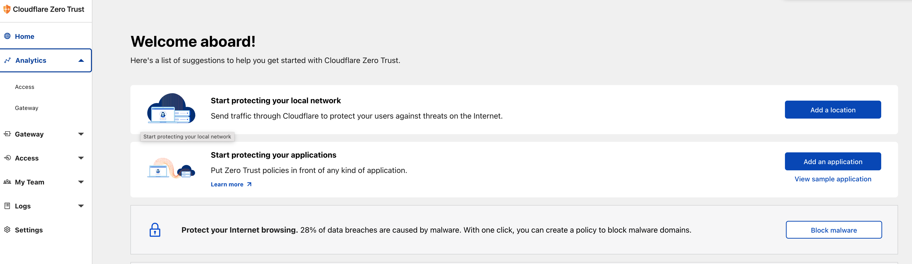

```{admonition} Additional Setup
:class: note
If you are not brought directly into the Zero Trust Dashboard - you may have to go through the initial setup setups - be sure to choose the **FREE** plan when selecting a tier, once complete you should be brought to the above page
```

From here, on the right hand navigation select **Gateway > Locations** on the following screen press **Add a location** now you will be asked for some details as seen below:

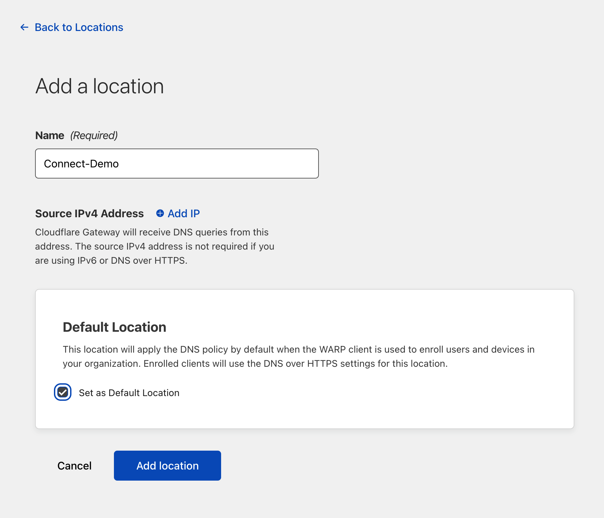

All you need to do here is enter a name for the location. Since we are using DNS over HTTPS we do not need to define a source IPv4 Address.

```{admonition} REMOVE ANY AUTO-CREATED IPS
:class: error
There will probably be an IP entered in the "Source IPv4 Address" make sure you delete it - This may cause issues for other attendees
```

Once created you will be given a DoH address for the location you just created - Take note of this as we will need it for our Docker Compose file

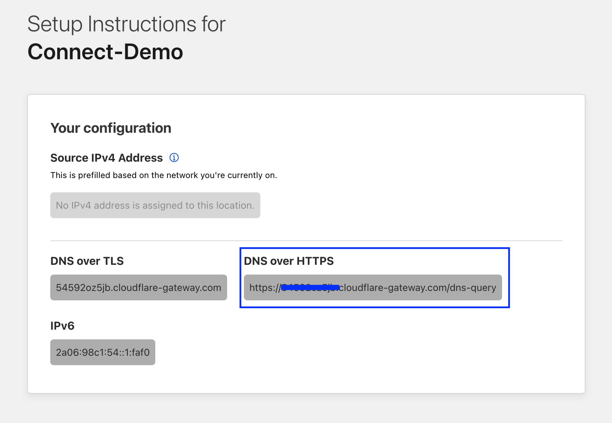

#### Edit Environment Variables with DoH ####

Returning to the Docker Compose file find the *Environment Variables* for the cloudflared service (line 16) and enter the DoH address from the pervious step

``` yaml
environment:
  # DoH endpoint THIS SHOULD BE MODIFIED BASED ON GUIDE
  - "TUNNEL_DNS_UPSTREAM=https://XXXXXX.cloudflare-gateway.com/dns-query"
```

### Launch Containers ###
Once the file is saved launch the containers via docker compose:

``` sh
docker-compose up -d
```
```{admonition} Errors Launching Containers
:class: warning
If you get an error claiming `Cannot connect to the Docker daemon at unix:///var/run/docker.sock. Is the docker daemon running?` you will need to launch the app from the application launcher
``` 

If successful you should see the following output

```
[+] Running 3/3
 ⠿ Network connect_2022_lab4_default  Created         0.0s
 ⠿ Container cloudflared              Started         0.4s
 ⠿ Container pihole                   Started         0.8s
 ```

```{admonition} Errors Launching Containers
:class: warning
If you have any issues launching the containers make sure that there are no other services on the local system listening on port 80 or 53 as it will break the port binding
``` 

Once running you should be able to reach the pihole administrator portal at:

```
http://localhost/admin
```

Enter the URL into your web browser.

At the Pi-Hole Welcome screen press the *login* and enter the password defined in the Docker Compose file 

```{admonition} Default Password
:class: note
If you did not edit the file the password should be **connect-2022**
```

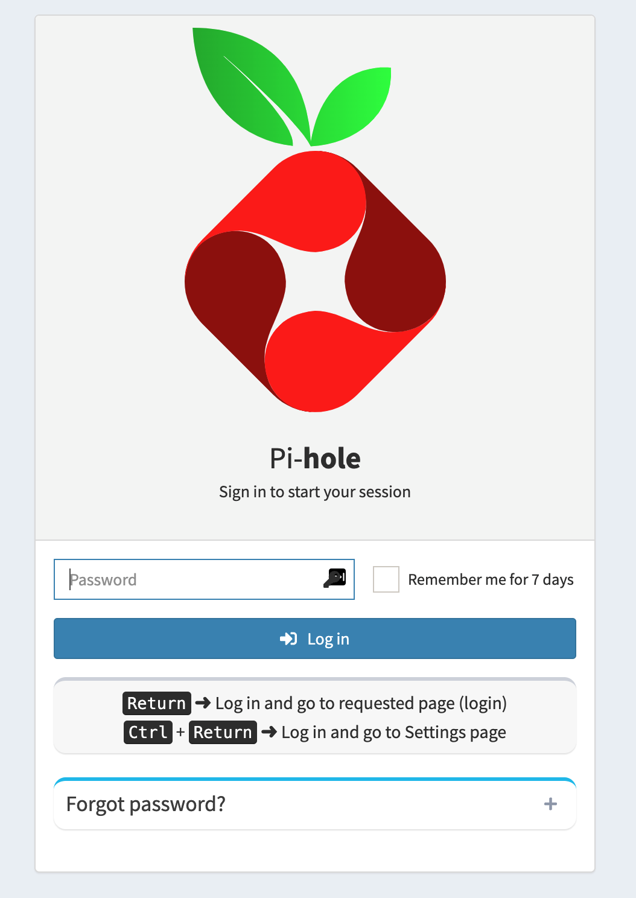

Once logged in navigate to the **Settings** on the left hand navigation pane, and then select **DNS** on the top row of tabs.

You should see that the **Upstream DNS Servers** have a single entry for our cloudflared container service.

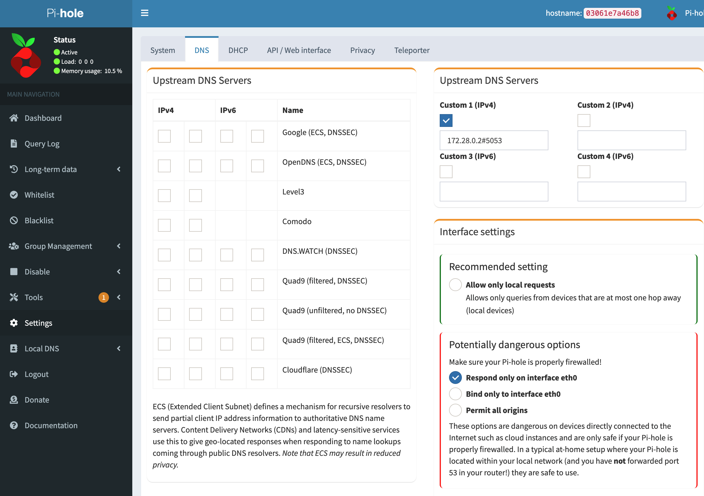

```{admonition} cloudflared service IP
:class: note
You may have a different IP address set for your DNS server but that is as expected, the value is dynamically linked to the cloudflared service by docker in the background
```

### Test DNS Forwarding ###

We can now validate that DNS resolution is working on the new setup by quickly running an nslookup command

``` sh
nslookup google.com localhost
```

This will ask the *localhost* (Pi-Hole DNS Server) for a resolution on google.com. We should get a result and now be able to dig into the logs to see the request was properly forwarded to Cloudflare.

First lets return to the Pi-Hole [dashboard](http://localhost/admin)
Here on the main dashboard we should see a few new queries - if we navigate to **Query Log** on the left navigation pane we should see that our initial DNS query was sent to our Cloudflare DoH forwarder on port 5053

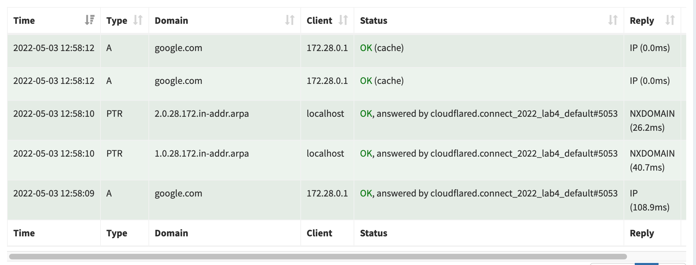

To confirm the request made it to Our Cloudflare ZT Gateway we can return to [dashboard](https://dash.teams.cloudflare.com)

In the Cloudflare ZT dasbhoard navigate to **Logs > Gateway** and enter the domain you requested (in our case it was google.com). You should see a query log for it as well as confirmation that the *Protocol type* was *HTTPS* and the *Location* was our demo location we created earlier.

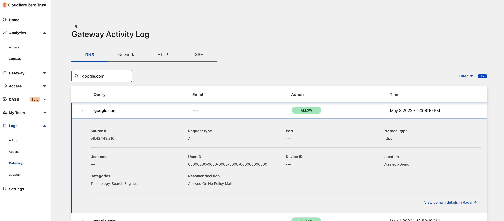

#### Create DNS Filtering Rule ####

Now that we have successfully passed traffic through to our Cloudflare Zero Trust Gateway we can write filtering policies to block access to specific domains. 

In the Cloudflare ZT dashboard navigate to **Gateway > Policies** and select **Create a policy**

In the Policy Creation , lets write a policy to Block the category of Gambling.

The policy should have the following settings 

```
Step 1 - "Block Gambling"
Step 2 - Selector "Content Categories" + "in" + "Gambling"
Step 3 - "Block"
Step 4 - Display Block Page "On"
Step 5 - Press Create Policy
```

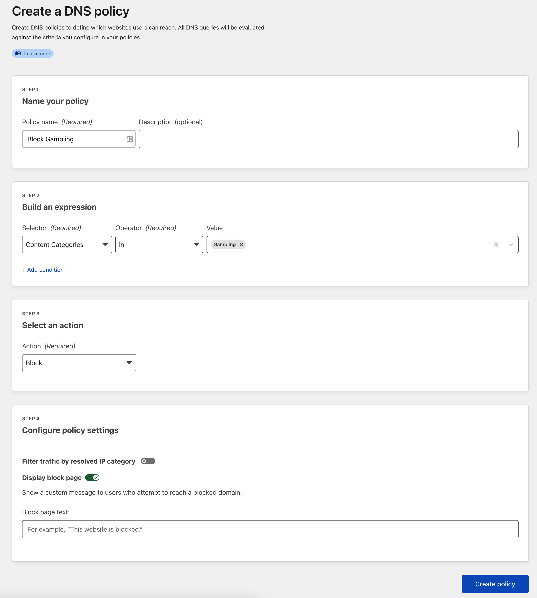

#### Change System DNS Settings ####

In order to test our new filtering rule we must first redirect our DNS traffic to our new Pi-Hole DNS server.
Each operating system has a different process - The steps are generally shown below 

```{admonition} Before Changing DNS
:class: error
**BEFORE CHANGING DNS SETTINGS** document your current DNS servers and DNS settings, these changes will overwrite your current network settings and you will need to reset them once your tear down the lab on your local machine.
```

**MacOS**
1. Go to System Preferences. You can find it by pressing Command+Space on your Mac and typing System Preferences.

2. Click on the icon called Network.


3. Click Advanced.

4. Select the DNS tab. Remove any IP addresses that may be already listed and in their place add **127.0.0.1**

**Linux**
1. Edit the resolve.conf file
``` sh
sudo vim/etc/resolv.conf
```

2. Replace the nameserver lines with **127.0.0.1**

**Windows**
1. Click on the Start menu, then click on Control Panel.

2. Click on Network and Internet.

3. Click on Change Adapter Settings.

4. Right click on the Wi-Fi network you are connected to.

5. Click Properties.

6. Select Internet Protocol Version 4.

7. Click Properties.

8. Click Use The Following DNS Server Addresses. Enter **127.0.0.1**

#### Test New DNS Filtering Rule ####

With the system configured to send DNS to our new setup we can go ahead and try going to any gambling site - <https://gambling.com>

You should have gotten the Cloudflare Block Page! 

```{admonition} LAB 4 COMPLETE! 
:class: note
You have successfully Completed Lab 4 - Cloudflare Zero Trust Gateway, now you have a ready to deploy docker compose file that you can take to any environment, even your own raspberry pi and start protecting your infrastructure with secure DNS.
```
